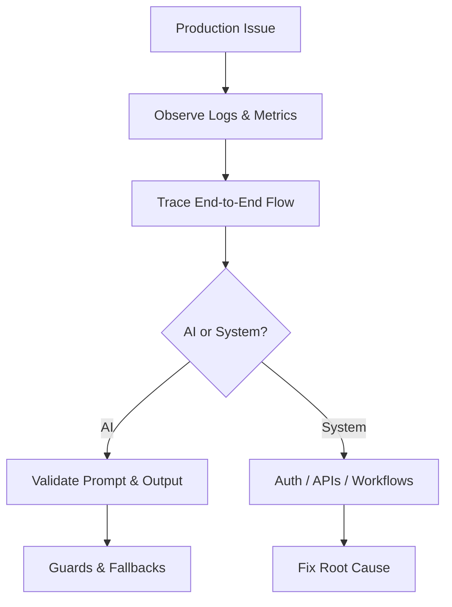
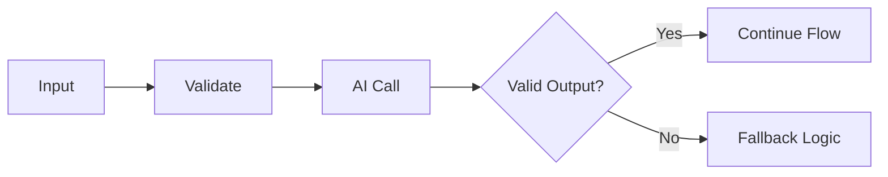
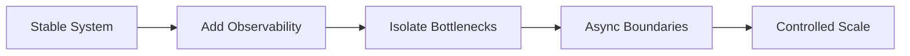
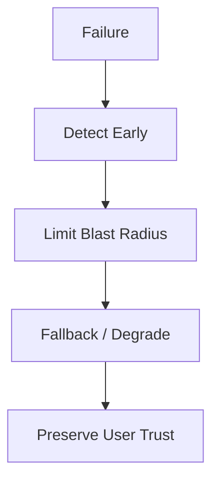

# AI System Ownership & Production Execution

This repository represents how I **own, stabilize, and scale an existing AI system in production**.

It is written for clients, founders, and CTOs who need someone to take **end-to-end responsibility** for a live system — not just write code, but ensure the system works reliably, scales safely, and survives real-world failures.

---

## Why This Repository Exists (Why Me)

Most AI systems don’t fail because of models.  
They fail because of **weak ownership, fragile workflows, and unhandled edge cases**.

I specialize in:
- Taking over **already-running AI systems**
- Diagnosing production issues without breaking auth or infrastructure
- Making independent, production-safe decisions
- Scaling systems under real constraints
- Treating AI as probabilistic, not magical

This repository shows **how I think and execute** when trusted with full ownership.

---

## Ownership Mindset

I take responsibility for the system **as if it were my own**.

Ownership means:
- I am accountable for production outcomes, not just tasks
- I proactively identify and fix issues
- I make trade-offs explicit (speed vs cost vs reliability)
- I do not wait for instructions to address obvious risks
- I protect existing infrastructure and authentication unless change is unavoidable

This is not staff augmentation.  
This is **system ownership**.

---

## Real-World Constraints (Non-Negotiable)

I design from reality, not ideal diagrams.

Typical constraints I work under:
- Infrastructure is already provisioned and live
- OAuth 2 (Google APIs) must remain unchanged
- Node.js backend
- n8n used for workflow orchestration
- Existing users, data, and business workflows
- AI outputs are non-deterministic

All decisions start from these constraints.

---

## High-Level System Architecture

```mermaid
flowchart LR
    A[Client / UI] --> B[Node.js API]
    B --> C[OAuth 2 / Google APIs]
    B --> D[n8n Workflow Engine]
    D --> E[AI / LLM Services]
    D --> F[Downstream Systems]
````

### Architecture Principles

* Authentication and infrastructure remain stable
* n8n orchestrates workflows, not business logic
* AI is a dependency, not a decision-maker
* Failures are handled at boundaries, not hidden

---

## How Requests Actually Execute

```mermaid
sequenceDiagram
    participant U as Client
    participant API as Node.js API
    participant Auth as OAuth / Google
    participant WF as n8n
    participant AI as AI Service
    participant DS as Downstream System

    U->>API: Request
    API->>Auth: Validate Token
    Auth-->>API: OK
    API->>WF: Trigger Workflow
    WF->>AI: Execute Prompt
    AI-->>WF: Response
    WF->>DS: Process / Persist
    DS-->>API: Result
    API-->>U: Final Response
```

This makes latency, retries, and failure points explicit.

---

## My Execution Approach

I follow a **stability-first execution model**.

1. Gain full visibility into request and data flow
2. Identify silent failures, retries, and bottlenecks
3. Stabilize auth, APIs, and workflows
4. Add guardrails around AI behavior
5. Scale incrementally with rollback paths

No big-bang rewrites.
No unnecessary infrastructure changes.

---

## System Diagnosis Framework



### Common Issues I See in Real Systems

* OAuth token refresh edge cases
* API rate limits under burst traffic
* Prompt drift over time
* n8n workflows doing too much synchronously
* Unbounded retries masking failures

---

## AI Reliability & Guardrails

AI is treated as **probabilistic infrastructure**.



What I consistently add:

* Input validation
* Structured output expectations
* Output validation and normalization
* Deterministic fallbacks
* Cost and latency limits

This keeps behavior predictable even when AI varies.

---

## Scaling Strategy (Without Breaking Production)



Scaling principles:

* Contain blast radius
* Isolate rate-limited integrations
* Reduce workflow coupling
* Prefer reversible changes

---

## Failure Modes & Risk Management

Production AI systems fail in **predictable ways**.

### Failure Categories

* **AI:** invalid outputs, latency spikes, provider outages
* **Workflows:** long-running n8n chains, silent retries
* **Integrations:** OAuth expiry, API quota exhaustion



I prioritize **graceful degradation over hard failure**.

---

## Relevant Experience (Representative Examples)

* Took ownership of an AI-driven automation system with OAuth and third-party APIs, stabilizing it under real production load.
* Diagnosed workflow failures caused by retries, token expiry, and prompt variance, then introduced validation and fallbacks.
* Scaled Node.js + workflow-based systems by isolating integrations and reducing synchronous execution paths.
* Replaced fragile automation with reliable backend services while preserving existing infrastructure.

Details vary per engagement, but the execution model remains consistent.

---

## What I Intentionally Do NOT Change

* OAuth providers and auth flows
* Stable infrastructure
* Working third-party integrations
* User behavior without evidence-based need

Restraint is part of senior ownership.

---

## How I Work With Clients

* Independent execution and accountability
* Clear written decisions and trade-offs
* Minimal meetings, maximum execution
* Production-first mindset
* Long-term system health over short-term fixes

---

## Engagement Fit

Best suited for teams that:

* Already have a live AI system
* Need stability and controlled scaling
* Want ownership, not supervision

Not a fit for throwaway prototypes or experiments.

---

## Closing

Thank you for taking the time to review this repository.

If you’re looking for someone to **own your AI system end-to-end**, stabilize it, and scale it responsibly, I’m happy to connect and discuss how this approach can help your team.


